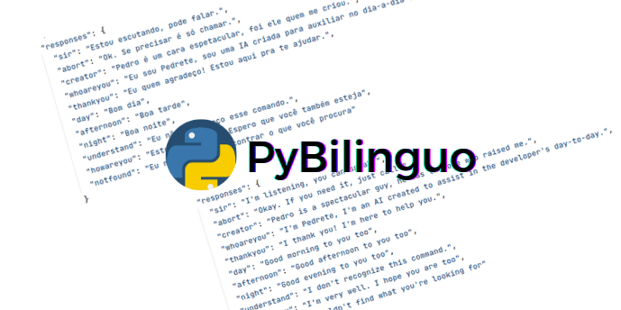

<p align="center">
    <a href="" rel="noopener">
        
    </a>
</p>

<h3 align="center">PyBilinguo</h3>

<div align="center">

[](https://github.com/preduus/pybilinguo/issues)
[]()
[]()
[](/LICENSE)

</div>


## 📝 Table of Contents

- [About](#about)
- [Installing](#installing)
- [Usage](#usage)
- [Built Using](#built_using)
- [Contribute](#contribute)
- [License](#license)

## 🧐 About <a name="about"></a>

The main idea of ​​the project is to facilitate the learning of other languages.
We created a simple AI that will interact with you. Just ask questions that if she knows, she will answer.

We have some basic phrases from Portuguese and English only.

### Prerequisites

What things you need to install the software and how to install them.

* Python 3.8 >=
* OS (Linux, Windows or Mac)

### Installing

A simple step by step that tell you how to execute project.

```bash
# Create environment and activate
$ virtualenv -p /usr/bin/python3.x venv && \
  source venv/bin/activate

# Install requirements
$ pip install -r requirements.txt
```

## 🎈 Usage <a name="usage"></a>

By default, if the language parameters are not informed, the Portuguese language will be added automatically.
```bash
# For choose language, add param:
$ python ai.py pt-BR
```
Only two languages are supported. pt-BR and en-US.

To activate the AI, just call the configured sir command.
```json
{
  "sir": "olá" // the "olá" value is my activation command
}
```

### Auto Translate
Machine translation mode works according to the presets made in the source language file.
can be found [here](./lang/contracts)

#### See example videos [here](https://youtube.com/playlist?list=PLnbZn6zK58XGCDGX7o8BPwnvH5blACb1w)


To translate from Portuguese to English, these are the settings.
```json
{
  ...
  "translate": ["traduza", "traduzir"], // Actions available to start translation
  "translate-nomore": "não",
  "translate-dest": { // Output sentences language
    "lang": "en",
    "region": "en-US"
  },
  "responses": { // AI responses
    ...
    "translate": "O que você deseja traduzir",
    "translate-more": "Deseja continuar traduzindo? Pode falar",
    "translate-end": "Qualquer coisa é só me chamar",
    ...
  },
  ...
}
```
See portuguese contract [pt-BR.json](./lang/contracts/pt-br.json)


## ⛏️ Built Using <a name="built_using"></a>

- [Speech Recognition](https://github.com/Uberi/speech_recognition#readme)
- [gTTS](https://github.com/pndurette/gTTS)
- [Playsound](https://github.com/TaylorSMarks/playsound)
- [GoogleTrans](https://py-googletrans.readthedocs.io/)

## ✍️ Authors <a name="authors"></a>

- [Pedro Rodrigues](https://github.com/preduus) - Idea & Initial work

## 📫 Contribute to project <a name="contribute"></a>
The project needs a lot of input for us to add more brokers providers, if you feel like helping or have some idea, please open an [issue](/../../issues) and help us.

1. Fork the project.
2. Create a branch: `git checkout -b feature/<branch_name>`.
3. Commit your code changes: `git commit -m '<message>'`
4. Push to your work branch: `git push origin feature/<branch_name>`
5. Open a pull request.

Alternatively, see on GitHub docs [How to create a pull request](https://help.github.com/en/github/collaborating-with-issues-and-pull-requests/creating-a-pull-request).

## 📝 License <a name="license"></a>

Distributed under the BSD 3 License. See LICENSE for more information.
